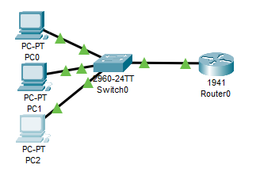

# Exercício IV
## Sobre o projeto:
Esse projeto tem como objetivo simular um ambiente onde um roteador foi instalado em uma rede com switch. 
## Exercício utilizado para a criação do projeto:
+ Configure o Router0 (1941) com o IP192.168.0.254 e máscara 255.255.255.0 na placa GigabitEthernet0/0.
+ Configure o host PC0 com o IP 192.168.0.1, máscara 255.255.255.0 e Gateway 192.168.0.254.
+ Configure o host PC1 com o IP192.168.0.2, máscara 255.255.255.0 e Gateway 192.168.0.254. 
+ Adicione um novo computador PC2 a rede e especificar um IP.
## Tecnologias utilizadas:
O projeto utiliza o Cisco Packet Tracer. 

## Principais funcionalidades:
Simular um ambiente onde um roteador foi utilizado. \

